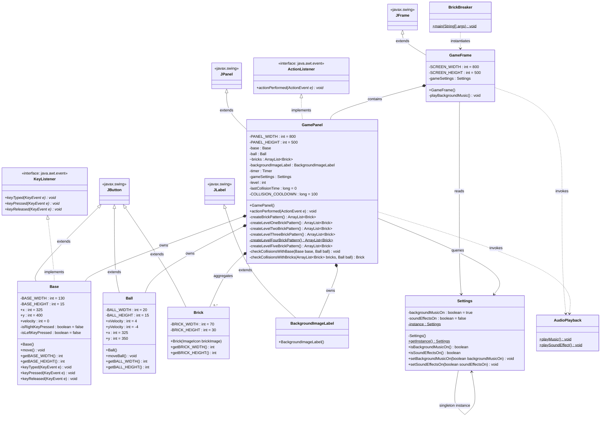
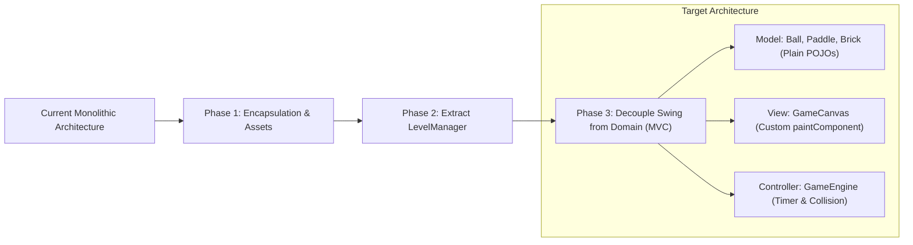

# Software Architecture & Quality Evaluation Report: Brick Breaker

**Course / Subject**: Object-Oriented Software Engineering & Quality Assurance  
**Project**: Bricks Game (Desktop Java Swing Application)  
**Analysis Date**: September 24, 2026  
**Evaluation Scope**: Full Codebase Reverse Engineering, CK Metric Suite Computation, and Architectural Defect Analysis  

---

## 1. Executive Summary

This report delivers a rigorous software analysis of the **Brick Breaker** Java codebase located in [src/brickbreaker](file:///c:/Users/lenovo/Desktop/Bricks/src/brickbreaker). The codebase consists of 9 source files executing a classic 2D arcade breakout game built on Java Swing/AWT and the Java Sound API. 

The evaluation is structured into three primary sections:
1. **Code Review & Reverse Engineering**: A formal architectural breakdown and derived UML Class Diagram capturing classes, attributes, methods, and structural relationships.
2. **Metric Analysis**: Exact empirical computation of the six **Chidamber and Kemerer (CK)** object-oriented metrics: WMC, DIT, NOC, CBO, RFC, and LCOM.
3. **Design Evaluation**: An in-depth evaluation of architectural anti-patterns (including the *God Class* and *Refused Bequest*), object-oriented design defects, and code smells, backed by quantitative metric findings.

---

## 2. Reverse-Engineered UML Class Diagram

### 2.1 UML Class Diagram (Mermaid)

### 2.2 Class Inventory and Structural Role

| Class | Package | Inheritance / Interfaces | Role & Responsibility |
| :--- | :--- | :--- | :--- |
| [`BrickBreaker`](file:///c:/Users/lenovo/Desktop/Bricks/src/brickbreaker/BrickBreaker.java) | `brickbreaker` | `java.lang.Object` | Application bootstrapper with `main()` method. |
| [`GameFrame`](file:///c:/Users/lenovo/Desktop/Bricks/src/brickbreaker/GameFrame.java) | `brickbreaker` | `JFrame` | Top-level Swing desktop window; handles window properties and background audio thread. |
| [`GamePanel`](file:///c:/Users/lenovo/Desktop/Bricks/src/brickbreaker/GamePanel.java) | `brickbreaker` | `JPanel`, `ActionListener` | Core orchestrator (God class): drives game loop (60 FPS), collision detection, level layout generation, and state. |
| [`Base`](file:///c:/Users/lenovo/Desktop/Bricks/src/brickbreaker/Base.java) | `brickbreaker` | `JButton`, `KeyListener` | Player paddle entity; handles keyboard input (`←` / `→`) and boundary movement. |
| [`Ball`](file:///c:/Users/lenovo/Desktop/Bricks/src/brickbreaker/Ball.java) | `brickbreaker` | `JButton` | Projectile entity; maintains velocity vector and screen edge rebounds. |
| [`Brick`](file:///c:/Users/lenovo/Desktop/Bricks/src/brickbreaker/Brick.java) | `brickbreaker` | `JButton` | Breakable block sprite with dimensions and visual icon rendering. |
| [`BackgroundImageLabel`](file:///c:/Users/lenovo/Desktop/Bricks/src/brickbreaker/BackgroundImageLabel.java) | `brickbreaker` | `JLabel` | Swing container loading and displaying `assets/bg.jpg` as the game surface. |
| [`Settings`](file:///c:/Users/lenovo/Desktop/Bricks/src/brickbreaker/Settings.java) | `brickbreaker` | `java.lang.Object` | Configuration manager implemented using the Singleton pattern. |
| [`AudioPlayback`](file:///c:/Users/lenovo/Desktop/Bricks/src/brickbreaker/AudioPlayback.java) | `brickbreaker` | `java.lang.Object` | Utility class managing continuous music looping and sound effect triggering via `javax.sound`. |

---

## 3. Chidamber and Kemerer (CK) Metric Analysis

The CK metric suite (Chidamber & Kemerer, 1994) evaluates object-oriented design across size, complexity, inheritance, coupling, and cohesion.

### 3.1 Metric Definitions
- **WMC (Weighted Methods per Class)**: Sum of the complexity of all methods in a class. Reported as both **Method Count** (normalized $w_i = 1$) and **McCabe Cyclomatic Complexity (CC)** sum.
- **DIT (Depth of Inheritance Tree)**: Maximum length of the inheritance path from the class to `java.lang.Object` (where `Object` has depth 0).
- **NOC (Number of Children)**: Number of immediate subclasses subordinated to a class in the project hierarchy.
- **CBO (Coupling Between Object Classes)**: Count of other classes to which a class is coupled (calls methods or accesses fields). Reported as **Internal CBO** (coupling within the project) and **Total CBO** (including standard JDK/Swing classes).
- **RFC (Response For a Class)**: Size of the response set: number of local methods plus the number of distinct external methods directly invoked ($RFC = |M| + |R_{ext}|$).
- **LCOM (Lack of Cohesion in Methods)**: Number of disjoint method pairs minus shared attribute method pairs ($LCOM = \max(0, |P| - |Q|)$). High LCOM indicates low cohesion.

### 3.2 Computed CK Metrics Table

| Class Name | WMC (Count) | WMC (McCabe CC) | DIT | NOC | CBO (Internal) | CBO (Total) | RFC | LCOM (CK 1994) |
| :--- | :---: | :---: | :---: | :---: | :---: | :---: | :---: | :---: |
| [`BrickBreaker`](file:///c:/Users/lenovo/Desktop/Bricks/src/brickbreaker/BrickBreaker.java) | 1 | 1 | 1 | 0 | 1 | 2 | 3 | 0 |
| [`GameFrame`](file:///c:/Users/lenovo/Desktop/Bricks/src/brickbreaker/GameFrame.java) | 2 | 3 | 6 | 0 | 3 | 6 | 17 | 1 |
| [`GamePanel`](file:///c:/Users/lenovo/Desktop/Bricks/src/brickbreaker/GamePanel.java) | **10** | **67** | 5 | 0 | **6** | **15** | **49** | **39** |
| [`Base`](file:///c:/Users/lenovo/Desktop/Bricks/src/brickbreaker/Base.java) | 7 | 13 | 6 | 0 | 0 | 8 | 20 | 5 |
| [`Ball`](file:///c:/Users/lenovo/Desktop/Bricks/src/brickbreaker/Ball.java) | 4 | 7 | 6 | 0 | 0 | 8 | 16 | 0 |
| [`Brick`](file:///c:/Users/lenovo/Desktop/Bricks/src/brickbreaker/Brick.java) | 3 | 4 | 6 | 0 | 0 | 4 | 9 | 0 |
| [`BackgroundImageLabel`](file:///c:/Users/lenovo/Desktop/Bricks/src/brickbreaker/BackgroundImageLabel.java) | 1 | 2 | 5 | 0 | 0 | 7 | 9 | 0 |
| [`Settings`](file:///c:/Users/lenovo/Desktop/Bricks/src/brickbreaker/Settings.java) | 5 | 7 | 1 | 0 | 0 | 0 | 6 | 6 |
| [`AudioPlayback`](file:///c:/Users/lenovo/Desktop/Bricks/src/brickbreaker/AudioPlayback.java) | 2 | 6 | 1 | 0 | 0 | 12 | 14 | 0 |

### 3.3 Metric Interpretation & Findings

1. **High Cognitive Complexity in [`GamePanel`](file:///c:/Users/lenovo/Desktop/Bricks/src/brickbreaker/GamePanel.java)**:
   - **WMC (McCabe CC = 67)** and **RFC (49)** for [`GamePanel`](file:///c:/Users/lenovo/Desktop/Bricks/src/brickbreaker/GamePanel.java) are disproportionately large. The collision detection routines ([`checkCollisionsWithBricks`](file:///c:/Users/lenovo/Desktop/Bricks/src/brickbreaker/GamePanel.java#L281) with CC=18 and [`checkCollisionsWithBase`](file:///c:/Users/lenovo/Desktop/Bricks/src/brickbreaker/GamePanel.java#L255) with CC=14) contribute high cyclomatic complexity with multi-clause compound conditionals.
2. **Extreme Lack of Cohesion (LCOM = 39)**:
   - For [`GamePanel`](file:///c:/Users/lenovo/Desktop/Bricks/src/brickbreaker/GamePanel.java), out of 45 possible pairwise method comparisons, 42 pairs share no common instance variables ($|P| = 42, |Q| = 3 \implies LCOM = 39$). The level generator methods ([`createLevelOneBrickPattern`](file:///c:/Users/lenovo/Desktop/Bricks/src/brickbreaker/GamePanel.java#L110) through [`createLevelFiveBrickPattern`](file:///c:/Users/lenovo/Desktop/Bricks/src/brickbreaker/GamePanel.java#L216)) operate purely on local variables, artificially inflating the class size and destroying cohesion.
3. **Deep Inheritance Trees from UI Misuse (DIT = 6)**:
   - [`Base`](file:///c:/Users/lenovo/Desktop/Bricks/src/brickbreaker/Base.java), [`Ball`](file:///c:/Users/lenovo/Desktop/Bricks/src/brickbreaker/Ball.java), and [`Brick`](file:///c:/Users/lenovo/Desktop/Bricks/src/brickbreaker/Brick.java) all exhibit a DIT of 6:
     $$\text{Object} \rightarrow \text{Component} \rightarrow \text{Container} \rightarrow \text{JComponent} \rightarrow \text{AbstractButton} \rightarrow \text{JButton} \rightarrow \text{Class}$$
   - These domain entities inherit hundreds of unused methods and UI states (such as focus, button models, accessibility hooks) that are unnecessary for geometric 2D game objects.
4. **Architectural Centralization (CBO = 6)**:
   - [`GamePanel`](file:///c:/Users/lenovo/Desktop/Bricks/src/brickbreaker/GamePanel.java) has an internal CBO of 6, as it directly couples to almost all other domain classes in the system ([`Base`](file:///c:/Users/lenovo/Desktop/Bricks/src/brickbreaker/Base.java), [`Ball`](file:///c:/Users/lenovo/Desktop/Bricks/src/brickbreaker/Ball.java), [`Brick`](file:///c:/Users/lenovo/Desktop/Bricks/src/brickbreaker/Brick.java), [`BackgroundImageLabel`](file:///c:/Users/lenovo/Desktop/Bricks/src/brickbreaker/BackgroundImageLabel.java), [`Settings`](file:///c:/Users/lenovo/Desktop/Bricks/src/brickbreaker/Settings.java), and [`AudioPlayback`](file:///c:/Users/lenovo/Desktop/Bricks/src/brickbreaker/AudioPlayback.java)). In contrast, the remaining classes have an internal CBO of 0 or 1.

---

## 4. Design Evaluation: Defects, Code Smells & Anti-Patterns

### 4.1 Major Anti-Patterns & Code Smells

#### 1. The God Class / Blob Anti-Pattern ([`GamePanel.java`](file:///c:/Users/lenovo/Desktop/Bricks/src/brickbreaker/GamePanel.java))
- **Description**: A single class monopolizes processing, holding excessive responsibilities and delegating very little.
- **Evidence**: [`GamePanel`](file:///c:/Users/lenovo/Desktop/Bricks/src/brickbreaker/GamePanel.java) controls:
  - Game loop timing and frame rate (~60 FPS `Timer`).
  - Level construction (5 hardcoded procedural patterns totaling >140 lines).
  - Physics and collision response (paddle rebounds and 4-sided brick AABB collisions).
  - Audio event triggering and level progression logic.
- **Metric Verification**: $\text{WMC} = 67$, $\text{RFC} = 49$, $\text{CBO} = 6$, $\text{LCOM} = 39$.
- **Impact**: Severe violation of the **Single Responsibility Principle (SRP)**. Modifying level geometry or altering collision rules risks breaking unrelated game loop operations.

#### 2. Refused Bequest / Misuse of Inheritance ([`Base`](file:///c:/Users/lenovo/Desktop/Bricks/src/brickbreaker/Base.java), [`Ball`](file:///c:/Users/lenovo/Desktop/Bricks/src/brickbreaker/Ball.java), [`Brick`](file:///c:/Users/lenovo/Desktop/Bricks/src/brickbreaker/Brick.java))
- **Description**: Subclasses inherit from a base class primarily to reuse a small piece of functionality (e.g. icon display), while ignoring or suppressing the vast majority of inherited behavior.
- **Evidence**: `Base`, `Ball`, and `Brick` extend `JButton` simply to leverage Swing's `setIcon()` and absolute coordinate positioning (`setBounds`). However, a bouncing ball or breakable brick is fundamentally **not** a clickable button.
- **Impact**: Brings heavy overhead (accessibility listeners, mouse event consumers, focus borders) and confuses the object model. In [`Ball`](file:///c:/Users/lenovo/Desktop/Bricks/src/brickbreaker/Ball.java#L28-L29), the author explicitly had to disable button features: `super.setBorderPainted(false); super.setFocusable(false);`.

#### 3. Broken Encapsulation & Inappropriate Intimacy
- **Description**: Classes expose internal state to outside manipulation, bypassing mutators and invariants.
- **Evidence**:
  - In [`Ball.java`](file:///c:/Users/lenovo/Desktop/Bricks/src/brickbreaker/Ball.java#L19-L22): `public int xVelocity`, `public int yVelocity`, `public int x`, `public int y`.
  - In [`Base.java`](file:///c:/Users/lenovo/Desktop/Bricks/src/brickbreaker/Base.java#L17-L19): `public int x`, `public int y`, `public int velocity`.
  - In [`GamePanel.java`](file:///c:/Users/lenovo/Desktop/Bricks/src/brickbreaker/GamePanel.java#L22): `ArrayList<Brick> bricks` has package-private (default) visibility.
- **Impact**: [`GamePanel`](file:///c:/Users/lenovo/Desktop/Bricks/src/brickbreaker/GamePanel.java) directly mutates coordinates and reverses velocity vectors (`ball.yVelocity *= -1`) rather than asking domain objects to update themselves (violating the *Tell, Don't Ask* principle).

#### 4. Hardcoded File System Paths & Classpath Fragility
- **Description**: Resources are addressed via relative host file paths (`new File("assets/...")`) instead of classpath resources.
- **Evidence**: Found in [`AudioPlayback.java`](file:///c:/Users/lenovo/Desktop/Bricks/src/brickbreaker/AudioPlayback.java#L20), [`GameFrame.java`](file:///c:/Users/lenovo/Desktop/Bricks/src/brickbreaker/GameFrame.java#L20), [`Base.java`](file:///c:/Users/lenovo/Desktop/Bricks/src/brickbreaker/Base.java#L33), and [`Ball.java`](file:///c:/Users/lenovo/Desktop/Bricks/src/brickbreaker/Ball.java#L33).
- **Impact**: Produces runtime crashes when launched from other directories or when packaged into a JAR. (During testing, executing `java -jar dist/Bricks.jar` triggered `java.io.FileNotFoundException: assets\bg-music.wav`).

#### 5. Audio Resource Leaks
- **Description**: Unclosed system resources allocated in frequent game loops.
- **Evidence**: In [`AudioPlayback.playSoundEffect()`](file:///c:/Users/lenovo/Desktop/Bricks/src/brickbreaker/AudioPlayback.java#L39-L52), an `AudioInputStream` and a `Clip` are allocated and started on every brick collision without calling `clip.close()` upon playback completion or recycling audio clips.
- **Impact**: Leads to audio line exhaustion and eventual memory leaks during extended gameplay.

#### 6. Primitive Obsession & Magic Numbers
- **Description**: Unnamed numeric literals hardcoded throughout business logic.
- **Evidence**: Magic numbers (`800`, `500`, `780`, `775`, `16`, `35`, `30`, `400`) are scattered throughout [`GamePanel.java`](file:///c:/Users/lenovo/Desktop/Bricks/src/brickbreaker/GamePanel.java) and [`Base.java`](file:///c:/Users/lenovo/Desktop/Bricks/src/brickbreaker/Base.java).
- **Impact**: Reduces maintainability and prevents painless screen resizing or resolution scaling.

#### 7. Inconsistent Design & Dead Artifacts
- **Evidence**:
  - [`createLevelFourBrickPattern()`](file:///c:/Users/lenovo/Desktop/Bricks/src/brickbreaker/GamePanel.java#L195) is declared `static`, whereas all other level creation methods are instance methods.
  - Presence of legacy compiled bytecode `Levels.class` in `build/classes/` that is no longer in `src/`, indicating inconsistent build hygiene.
  - Concurrency hazard: [`Settings.getInstance()`](file:///c:/Users/lenovo/Desktop/Bricks/src/brickbreaker/Settings.java#L10) lacks thread synchronization, risking multiple instances under multi-threaded initializations.

---

## 5. Prioritized Refactoring Recommendations

1. **Extract Level Generation**:
   - Move all `createLevelXBrickPattern()` routines from [`GamePanel`](file:///c:/Users/lenovo/Desktop/Bricks/src/brickbreaker/GamePanel.java) into a dedicated `LevelManager` or `LevelFactory` class. This will immediately reduce `GamePanel`'s WMC from 67 to ~35 and drop its LCOM by over 50%.
2. **Replace `JButton` with Pure Domain Entities (POJOs)**:
   - Redefine [`Ball`](file:///c:/Users/lenovo/Desktop/Bricks/src/brickbreaker/Ball.java), [`Base`](file:///c:/Users/lenovo/Desktop/Bricks/src/brickbreaker/Base.java), and [`Brick`](file:///c:/Users/lenovo/Desktop/Bricks/src/brickbreaker/Brick.java) as lightweight objects containing position, size, and bounding geometry (`java.awt.Rectangle`).
   - Draw sprites in a single `GameCanvas.paintComponent(Graphics g)` method using `Graphics2D.drawImage()`. This eliminates the DIT of 6 and removes Swing event listener overhead.
3. **Migrate to Classpath Resource Loading**:
   - Replace `new File("assets/...")` with `getClass().getResourceAsStream("/assets/...")` or `ClassLoader.getSystemResource()`. This resolves `FileNotFoundException` crashes across all operating systems and packaged JAR environments.
4. **Encapsulate Domain Coordinates**:
   - Set all entity coordinates to `private` and implement behavioral methods (e.g., `ball.reverseY()`, `ball.reverseX()`, `base.moveLeft()`) to enforce the *Information Expert* pattern.
5. **Implement Audio Pool / Clip Reuse**:
   - Pre-load and cache the `break.wav` `Clip` once in [`AudioPlayback`](file:///c:/Users/lenovo/Desktop/Bricks/src/brickbreaker/AudioPlayback.java) and rewind with `clip.setFramePosition(0)` instead of repeatedly opening new audio input streams.
